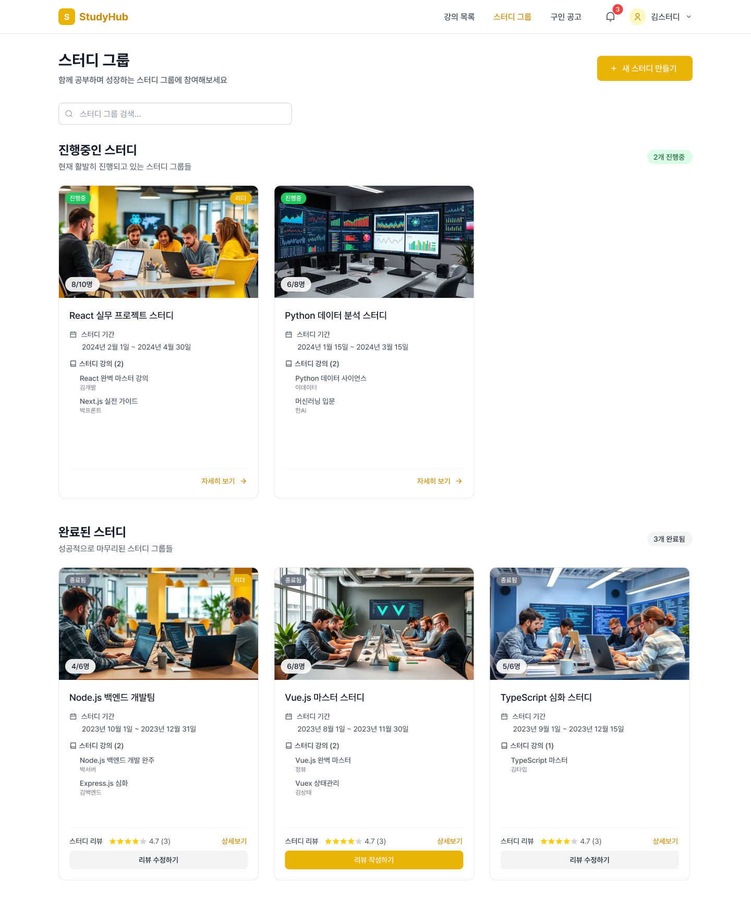
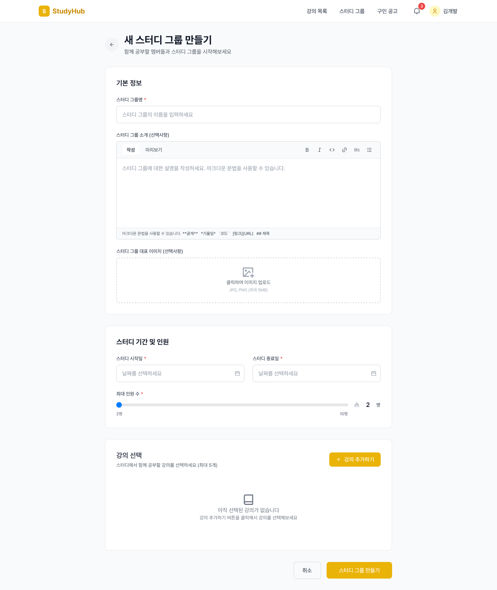
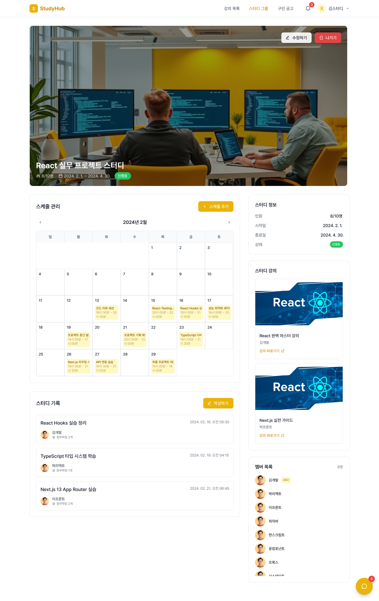
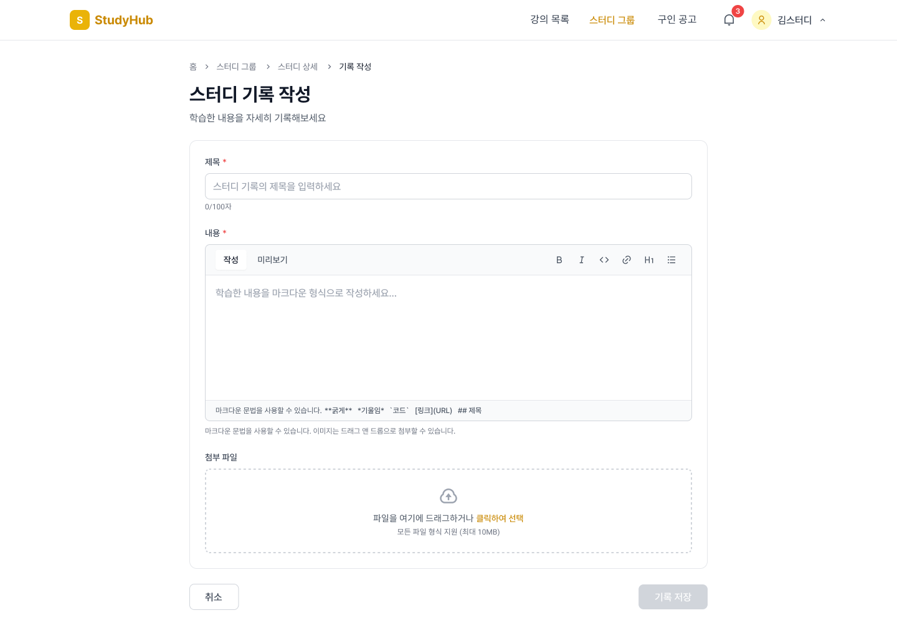
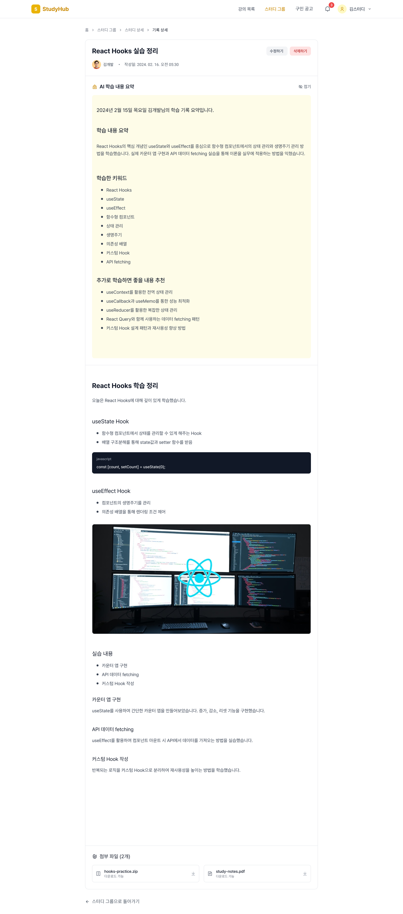

# 📚 StudyHub — 스터디 그룹 관리 플랫폼

🔗 **배포 링크:** https://study.ozcoding.site/

React + TypeScript 기반의 스터디 관리 웹 애플리케이션입니다.  
**Zustand**와 **TanStack Query**를 활용한 상태 관리,  
그리고 **컴포넌트 아키텍처 설계 능력**을 중심으로 구현했습니다.

> 이 프로젝트는 프론트엔드 개발자로서의 역량을 검증하기 위해 진행한 팀 프로젝트입니다.  
> 협업 환경에서의 코드 일관성, 상태 분리, UI 재사용성, 비동기 로직 설계 등  
> 실제 서비스 수준의 개발 문화를 체험하고 적용했습니다.

---

## 📖 목차

- [프로젝트 개요](#프로젝트-개요)
- [주요 기능](#주요-기능)
- [기술 스택](#기술-스택)
- [주요 구현 포인트](#주요-구현-포인트)
- [코드 스타일 & 품질 원칙](#코드-스타일--품질-원칙)
- [프로젝트 구조](#프로젝트-구조)
- [주요 라우트](#주요-라우트)
- [주요 페이지 미리보기](#주요-페이지-미리보기)
- [향후 개선 계획](#향후-개선-계획)
- [배운 점 및 회고](#배운-점-및-회고)
- [참고 자료](#참고-자료)
- [라이선스](#라이선스)

---

## 🧭 프로젝트 개요

스터디 그룹을 효율적으로 관리하고, 학습 기록을 체계적으로 남길 수 있는 웹 애플리케이션입니다.  
사용자는 **스터디 그룹을 생성·수정·삭제**하고, **그룹별 학습 기록**을 작성·공유하며,  
**멤버 관리**와 **검색/필터링**을 통해 원하는 정보를 빠르게 찾을 수 있습니다.

---

## ⚙️ 주요 기능

### 👥 스터디 그룹 관리

- 스터디 그룹 생성 / 수정 / 삭제
- 그룹 상세 정보 및 멤버 관리
- 검색 및 필터 기능

### 📚 학습 기록

- 마크다운 기반의 학습 기록 작성
- 수정 / 삭제 / 날짜별 조회
- 코드 하이라이팅 기능 제공

### 💡 사용자 경험

- 직관적인 UI/UX
- 반응형 디자인
- 실시간 알림 (Toast)
- 부드러운 애니메이션 효과

---

## 🧰 기술 스택

| 구분                   | 기술                                        |
| ---------------------- | ------------------------------------------- |
| **Frontend Framework** | React 19.1.0                                |
| **Language**           | TypeScript 5.8.3                            |
| **Build Tool**         | Vite 6.3.5                                  |
| **State Management**   | TanStack Query 5.80.7, Zustand 5.0.5        |
| **Styling**            | Tailwind CSS 4.1.10, Framer Motion 12.23.24 |
| **UI Library**         | Lucide React, React Toastify                |
| **Routing**            | React Router 7.6.2                          |
| **Date/Markdown**      | Day.js, React Markdown, React Day Picker    |

---

## 🧩 주요 구현 포인트

### 1️⃣ 상태 관리 구조 설계

- **서버 상태 (TanStack Query)** 와 **클라이언트 상태 (Zustand)** 를 명확히 분리.
- API 쿼리 훅을 `src/hooks/api/queries`에서 도메인 단위로 모듈화.
- 전역 상태는 도메인별(`storeModalOpen`, `storeReview`, `storeSchedule`)로 세분화.

### 2️⃣ 컴포넌트 아키텍처

- `BasicButton`, `BasicInput`, `ToastContainer` 등 공통 컴포넌트 설계.
- Props Drilling 없이 명확한 데이터 흐름을 유지.
- 모달/토스트/로딩 UI를 재사용 가능한 구조로 캡슐화.

### 3️⃣ 비동기 처리 & 에러 핸들링

- React Query의 전역 설정(`retry:1`, `staleTime:5분`)으로 네트워크 효율 개선.
- Axios 인스턴스 기반의 공통 인터셉터 설계.
- 로딩/에러/빈 상태를 일관된 UX로 관리.

### 4️⃣ UI/UX 개선

- Framer Motion으로 모달·툴팁 애니메이션 구현.
- Toastify로 실시간 피드백 제공.
- 반응형 Tailwind CSS 기반 레이아웃 구성.

### 5️⃣ 협업 환경

- **브랜치 전략:** `feat/`, `fix/`, `chore/` 접두어로 역할 구분.
- **커밋 컨벤션:**  
  `<type>: <commit message> (#issue number)`

### ✅ 예시

```text
feat: add StudyGroupDetail page (#93)
fix: resolve modal delay issue (#27)
refactor: optimize Zustand store structure (#15)
docs: update README with deployment guide (#44)
```

### 🔠 커밋 유형

| Type       | 설명                                 |
| ---------- | ------------------------------------ |
| `feat`     | 새로운 기능 추가                     |
| `fix`      | 버그 수정                            |
| `refactor` | 코드 리팩터링 (기능 변화 없음)       |
| `docs`     | 문서 수정 (README 등)                |
| `style`    | 코드 포맷팅, 세미콜론 등 비기능 변경 |
| `chore`    | 설정, 빌드, 패키지 관련 변경         |

## 🧾 코드 스타일 & 품질 원칙

### 네이밍 규칙

- 컴포넌트: **PascalCase** (예: `StudyGroupCard`)
- 함수/변수: **camelCase** (예: `fetchUser`, `isLoading`)
- 상수: **UPPER_SNAKE_CASE** (예: `API_BASE_URL`)
- 파일명: **kebab-case** 또는 PascalCase

### 🔹 코드 품질 원칙

1. **일관성 (Consistency)**  
   네이밍, 파일 구조, import 경로를 통일해 협업 시 혼선을 최소화했습니다.

2. **명시성 (Clarity)**  
   컴포넌트·훅·스토어의 역할을 명확히 구분해  
   데이터 흐름과 책임 범위를 쉽게 이해할 수 있도록 설계했습니다.

3. **재사용성 (Reusability)**  
   공통 UI 컴포넌트(`basicComponents`)와 유틸 함수, API 훅을 분리하여  
   중복 코드를 줄이고 유지보수를 용이하게 했습니다.

4. **유지보수성 (Maintainability)**  
   Zustand 스토어, React Query 훅, 페이지 컴포넌트를 기능/도메인별로 모듈화하여  
   수정 시 영향 범위를 최소화했습니다.

5. **가독성 (Readability)**  
   의미 있는 변수명과 함수명 사용을 원칙으로 하고,  
   불필요한 축약 표현은 지양했습니다.

### 🔹 포맷팅 & 린트

- **Prettier**
  - 세미콜론 제거
  - 홑따옴표 사용
  - Tailwind 정렬 플러그인 적용

- **ESLint 플러그인**
  - `@eslint/js`
  - `typescript-eslint`
  - `react-hooks`
  - `react-refresh`

- **사용 규칙 예시**
  - `no-var`, `prefer-const`
  - `@typescript-eslint/no-unused-vars`
  - `_`로 시작하는 변수는 무시
  - HMR 안정화를 위한 `react-refresh/only-export-components` 적용

### 🔹 상태 계층 분리

프로젝트에서는 **서버 상태(TanStack Query)** 와 **클라이언트 상태(Zustand)** 를 명확하게 분리해 관리했습니다.

#### 📌 서버 상태 (TanStack Query)

- `queryKeys.ts`  
  서버 데이터 캐싱을 위한 “쿼리 키”를 한 곳에서 관리합니다.

- `hooks/api/queries`  
  각 도메인(스터디 그룹, 리뷰, 일정 등)에 맞는  
  **React Query 기반 API 요청 훅**을 모아둔 폴더입니다.

#### 📌 클라이언트 상태 (Zustand)

- `store/`  
  모달, 리뷰, 일정 등 전역 상태를 담당하는 Zustand 스토어를  
  **도메인 단위로 분리하여 관리**합니다.

#### 📌 설계 의도

이 구조 덕분에 다음이 명확해졌습니다:

- **데이터 요청 로직**
- **UI 렌더링 컴포넌트**
- **전역 클라이언트 상태**

세 요소 간의 책임 분리가 확실해져  
코드의 유지보수성과 확장성이 크게 향상되었습니다.

## 🔹 재사용성 강화 요소

- 공통 컴포넌트: `components/basicComponents/`
- 도메인 기반 페이지 구조: `pages/study-groups`, `pages/study-records`
- 전용 훅: 모달, 토스트, 디바운스 등 UI/로직을 독립적으로 관리

## 🔹 명시성 & 유지보수성

- 상태/프롭/응답 타입을 TypeScript로 명확히 지정
- API·스토어·UI 간 관심사를 분리해 의존성 최소화
- 비즈니스 로직은 훅에서, 컴포넌트는 데이터 표현에 집중

---

## 🗂 프로젝트 구조

```text
src/
├── api/              # API 클라이언트 및 요청 함수
├── components/       # 재사용 가능한 컴포넌트
├── hooks/            # 커스텀 훅
│   └── api/          # API 관련 훅 (React Query)
├── pages/            # 페이지 컴포넌트
│   ├── study-groups/     # 스터디 그룹 관련 페이지
│   └── study-records/    # 스터디 기록 관련 페이지
├── store/            # 전역 상태 관리 (Zustand)
├── types/            # TypeScript 타입 정의
├── utils/            # 유틸리티 함수
└── constants/        # 상수 정의
```

---

## 🧭 주요 라우트

| 경로                                                | 설명                                                       |
| --------------------------------------------------- | ---------------------------------------------------------- |
| `/`                                                 | 참여 중인 **스터디 그룹 목록을 확인**하는 페이지           |
| `/create_study_group`                               | 새로운 **스터디 그룹을 생성**하는 페이지                   |
| `/edit_study_group/:studyGroupId`                   | 특정 **스터디 그룹의 정보를 수정**하는 페이지              |
| `/study_group_detail/:studyGroupId`                 | 일정, 기록, 구성원 등을 포함한 **스터디 그룹 상세 페이지** |
| `/create_study_record/:studyGroupId`                | 해당 그룹의 **학습 활동을 기록하고 공유하는 페이지**       |
| `/edit_study_record/:studyGroupId/:studyRecordId`   | 작성된 **학습 기록 내용을 편집**하는 페이지                |
| `/study_record_detail/:studyGroupId/:studyRecordId` | 특정 기록의 내용을 **열람하는 상세 페이지**                |

---

## 📸 주요 페이지 미리보기

> 아래는 각 주요 페이지의 UI입니다. (피그마)

### 🏠 스터디 그룹 목록 페이지 (`/`)



### ➕ 스터디 그룹 생성 페이지 (`/create_study_group`)



### 📄 스터디 그룹 상세 페이지 (`/study_group_detail/:studyGroupId`)



### ➕ 학습 기록 생성 페이지 (`/create_study_record/:studyGroupId`)



### 📄 학습 기록 상세 페이지 (`/study_record_detail/:studyGroupId/:studyRecordId`)



---

## 🔧 향후 개선 계획

### 1. 개발 생산성 및 구조 개선

- 타입 스키마 기반 API 테스트 툴 제공  
  → Swagger와 유사하게, 프론트엔드 환경에서 직접 API 호출 및 검증 가능
- Mock 데이터 의존 제거 및 **실제 요청 기반 테스트 환경 구축**
- API 구조 리팩토링 및 요청 흐름 체계화로 유지보수성 강화

---

### 2. 안정적인 파일 업로드 시스템 강화

- **Presigned URL 기반 업로드 프로세스 체계화**  
  → 이미지 및 파일 업로드 시 안정성과 보안성 확보
- 대용량 파일 업로드에 대응 가능한 구조 확장

---

### 3. AI 기반 학습 보조 기능 도입

- 사용자가 학습하고 싶은 내용을 입력하면  
  **AI가 학습 일정 및 계획을 자동 추천**
- 스터디 일정 + 학습 목표 + 진행률 기반 맞춤형 피드백 제공
- 학습 리마인더 및 진도 관리 등 AI 학습 코치 기능 확장

---

## 👤 역할 & 기여

### 🧑‍💻 우혜림 (FE 리드)

- 모달 UI 개발: 날짜 선택, 강의 선택, 리뷰 작성/수정, 일정 생성/상세 등 다양한 모달 콘텐츠 컴포넌트 구현
- 모달 관련 API 연동: 강의 목록 조회, 리뷰 생성·수정·조회 기능 개발
- CI 구축: GitHub Actions를 이용한 자동 배포 파이프라인 구성
- Vercel을 통한 배포 및 환경 설정 담당
- README 문서 작성 및 팀 코드 품질 관리
- 팀원 기술 서포트 및 협업 지원

---

### 🧑‍💻 김가람

- 네비게이션 바, 푸터, 채팅 등 공통 UI 및 레이아웃 컴포넌트 구현
- 기본 모달 컴포넌트 및 재사용 가능한 UI 패턴 설계
- Axios 기반 API 요청 로직 및 인터셉터 구현
- 타입-링크 변환을 위한 커스텀 라이브러리 제작
- 클래식 문법을 활용한 요청 순서 제어 로직 개발

---

### 🧑‍💻 양은지

- 스터디 그룹 생성 및 수정 페이지 UI 및 비즈니스 로직 개발
- 스터디 기록 상세 페이지 및 이미지 업로드 기능 구현
- 마크다운 기반 편집기 및 미리보기 기능 구현
- Breadcrumb 컴포넌트 구현 및 UX 개선
- Toast 알림 컴포넌트 적용 및 사용자 피드백 강화
- 프로젝트 발표 및 PPT 제작 담당

---

### 🧑‍💻 유용균

- 스터디 그룹 메인 페이지 구현
- 스터디 기록 작성 페이지 UI 및 기능 구현

---

### 🧑‍💻 최도혁

- 스터디 그룹 상세 페이지 및 메인 페이지 구현
- 검색 결과 없음 UI 구현
- 페이지네이션 적용 및 UI 컴포넌트 분리
- 그룹 기능 API 연동:
  - 그룹원 탈퇴
  - 리더 위임
  - 멤버 추방
- 스터디 일정/기록 모달 기반 생성 및 상세 보기 기능 구현

---

## 💬 배운 점 및 회고

이 프로젝트를 통해 다음과 같은 역량을 향상시켰습니다:

- **현대적인 React 생태계 전반**을 이해하고 실무 수준으로 적용
- **타입 안정성과 상태 관리 패턴**의 중요성 체득
- **코드 리뷰 및 협업 프로세스**를 통한 팀 생산성 향상
- **UX 개선 루프**(로딩, 에러, 접근성) 반영의 중요성 인식

---

## 🔗 참고 자료

- **레포지토리:** [GitHub Repository](https://github.com/OZ-Coding-School/oz_externship_fe_03_team1)
- **와이어프레임:** [Figma Design](https://www.figma.com/design/ALoyv0OXgrUUIeabkAnC64/12%EA%B8%B0-%EC%9D%B5%EC%8A%A4%ED%84%B4%EC%8B%AD-StudyHub-?node-id=0-1&p=f&t=pOuGD2nijaDpl106-0)
- **React 공식 문서:** [https://react.dev](https://react.dev)
- **TanStack Query:** [https://tanstack.com/query/latest](https://tanstack.com/query/latest)
- **Zustand:** [https://docs.pmnd.rs/zustand](https://docs.pmnd.rs/zustand)
- **Tailwind CSS:** [https://tailwindcss.com](https://tailwindcss.com)
- **Framer Motion:** [https://www.framer.com/motion/](https://www.framer.com/motion/)

---

## 🪪 라이선스

**Private** — 사내 및 교육 목적으로만 사용 가능합니다.  
무단 복제 및 배포를 금합니다.
